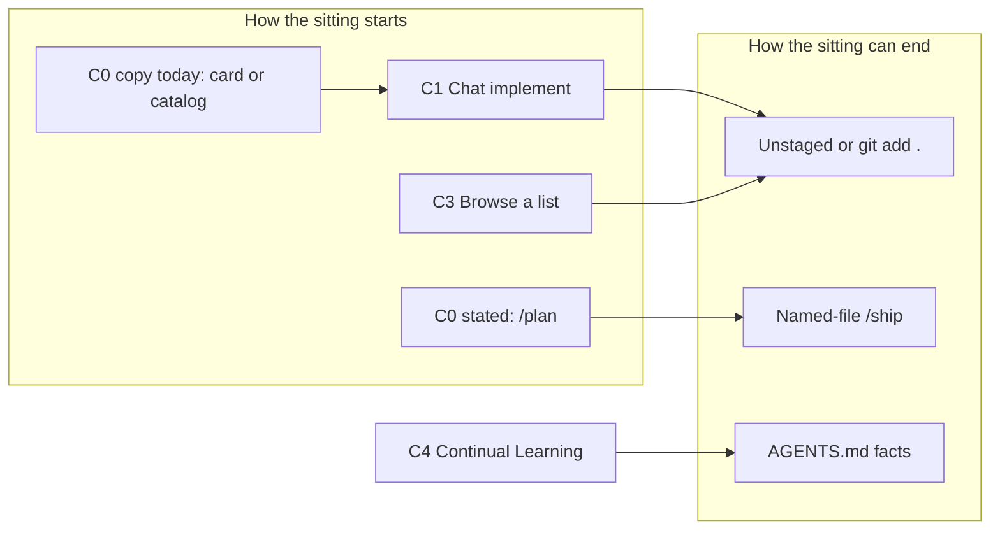

# Competitive UX analysis: Work Kit first delivery

**Job being compared:** How an IC starts and finishes a Cursor sitting: plan (or skip), edit, review the real diff, ship named files.
**Not a market study.** No TAM, no share, no NPS, no paid tools. Desk analysis of adjacent jobs on 16 Sep 2026. We did not run competitor usability. Do not paste this as SEO.
**Related:** [Messaging](work-kit.md), [STARTER_PLUGINS.md](../../STARTER_PLUGINS.md), [User flow](../user-flows/work-kit-first-delivery.md), [Scope](../launches/q4-2026-first-delivery-scope.md)
**Source prompt:** [Competitive analysis](https://aiuxplayground.com/prompts/competitive-analysis) (AI UX Playground)

Work Kit's live miss is not "missing a catalog." It is install copy that still congratulates Customize. Competitors below are **jobs Avery already has**, not companies to beat on a landing page.

---

## 1. Competitor overview

| ID | Product / pattern | Audience | Positioning | Differentiator |
| --- | --- | --- | --- | --- |
| C0 | Work Kit (`work-kit`) | Avery, desktop Cursor. Casey phase 2 | Once-per-machine loop: `/plan` to `/ship` | Named slashes, user-scope plugin, ship refuses junk staging |
| C1 | Cursor default chat | Anyone in Cursor | "Ask, then it edits" | Zero install. Fast. No plan gate |
| C2 | `npx skills add` / skills CLI | People hunting one SKILL.md | Drop files onto disk | Fast add. May not install this plugin's slashes |
| C3 | GitHub skill lists (e.g. awesome-cursor-skills) | Browsers | Discovery catalog | Breadth. No default delivery bar |
| C4 | Continual Learning (Marketplace) | ICs who want durable facts | Writes workspace facts into `AGENTS.md` | Memory across sittings. Not a ship path |
| C5 | Other Marketplace plugins (GitHub, Create Plugin) | Same, user scope | Repos/PRs, scaffold plugins | Orthogonal to Plan to Ship |
| C6 | Copy `.cursor/` / kit files into each app repo | Teams that "just vendor it" | Repo-local kit | Follows the repo. Fights user-scope. README forbids this for Work Kit |
| C7 | Playground / catalog dumps into the kit | Builders collecting skills | More SKILL.md files | Growth of inventory. Does not start `/plan` |

**Target audiences (ours vs theirs).** Avery wants the same bar in every personal repo. C1 wins when Avery is impatient. C3 wins when Avery is shopping. C4 wins when Avery wants facts to stick in the repo. C6 wins when a team insists the kit live in git of the product. None of them own "first delivery after install" except C0, and C0 currently teaches C1's finish line (plugin visible / chat).

**Market positioning.** Not a billed quadrant. Honest map of where the **first minute** goes:

**Stated Work Kit** is default loop then named-file ship. **Shipped copy today** routes to C1 (card / chat) or C3 (catalog). That gap is the competitive finding that matters.

---

## 2. Feature comparison

Legend: Y = designed to do it. P = possible if the user already works that way. N = not the job.

| Capability | C0 Work Kit | C1 Chat | C2 skills CLI | C3 Lists | C4 Continual Learning | C5 GH plugin | C6 Copy into repo |
| --- | --- | --- | --- | --- | --- | --- | --- |
| User-scope, once | Y | Y (Cursor) | P | N | Y | Y | N |
| `/plan` slash | Y | N | N unless this plugin | N | N | N | P if copied |
| Wait for accept before edits | Y (skill) | N | P | N | N | N | P |
| Tiny skip as a named state | Y (log) | N | N | N | N | N | N |
| Review actual `git diff` | Y `/review-diff` | P | N | N | N | P (PRs) | P |
| Named-file ship, no `git add .` | Y `/ship` | N | N | N | N | N | N |
| Refuse `.env` in skill text | Y | N | N | N | N | N | N |
| Durable facts in `AGENTS.md` | N (leave to C4) | N | N | N | Y | N | P |
| Browse many community skills | P (opt-in preset) | N | Y | Y | N | N | P |
| Cloud VM sees local plugin | N | Y (agent) | P if synced | N | P | P | N |
| Marketplace listing | N (out of scope) | n/a | N | N | Y | Y | N |
| Install next-step is `/plan` | **N today** | n/a | N | N | N | N | N |

**Parity.** Work Kit is not behind C3 on catalog size. It is behind C1 on time-to-first-edit, on purpose. It is behind its own README job line on install copy.

**Unique to C0 (stated).** Named `/plan` `/debug` `/review-diff` `/ship`. Session log. Real-directory install. Ship skill forbids junk staging.

**Missing vs C1.** Instant implement. That is a cut, not a gap to fill.

**Missing vs C4.** Memory into `AGENTS.md`. Complement, not a gap.

**Missing vs C3.** Discovery UX. Lists are better. Do not clone that IA into first delivery.

**Missing vs ourselves.** G3: step 3 is still optional sync / catalog, so unique features are undiscoverable after install.

---

## 3. UX pattern analysis

None of these are consumer apps with tab bars. The "navigation" is how a sitting starts.

**Navigation.**

| ID | Start pattern |
| --- | --- |
| C1 | Open chat. Type implement. Files change |
| C2 | Terminal, `npx skills add`, hope a skill fires |
| C3 | Browser, README table, copy a URL |
| C4 | Marketplace, Customize, User, plugin learns facts |
| C5 | Same Customize rail as C4 |
| C6 | Copy folders in git. Every repo is a fork of the kit |
| C0 stated | README / script: Reload, Customize, **product repo `/plan`** |
| C0 today | README / script: Reload, Customize, **sync or catalog** |

**Information architecture.** C3 and Playground catalogs are wide (many names). C0 checkout README currently dumps that width into numbered install steps 3-4. That is C3's IA leaking into C0's first-run. C4 IA is `AGENTS.md` in the product repo. C0 IA should be four slashes plus a Cloud Agents appendix.

**Interaction.** C1 is streaming edits. C0 wants accept/reject then edit. C5 GitHub is issue/PR verbs. `/ship` is git verbs. Do not mix Marketplace install UI into the loop.

**Visual design.** We do not own Cursor chrome. Compete in terminal echo and GitHub markdown: numbered lists, sentence case, no emoji success. C3 READMEs often win on density of badges and tables. Do not adopt badge soup for E1.

**Content strategy.**

- C1: no content. The empty prompt is the product.
- C3: exhaustive lists. Good for shopping. Bad as step 3 of install.
- C4: facts in `AGENTS.md`. Keep that content in the product repo.
- C0 should: one job in three beats. Catalogs behind a preset script, not in the first numbered list.

**Pattern to avoid (live in our copy).** Treating Customize visibility or a skill inventory as the end of onboarding. That is C1 + C3, not first delivery.

---

## 4. Strengths and weaknesses

**C1 Chat.** Strength: zero friction, always there. Weakness: no accept gate, `git add .` culture, no log. Gap: Avery cannot refuse a plan that was never written.

**C2 skills CLI.** Strength: one command. Weakness: SKILL.md without `/plan` slash. Users think they installed Work Kit. Gap: E3 confusion (already in the user flow).

**C3 Lists.** Strength: discovery. Weakness: no bar. Pain: infinite install, no ship.

**C4 Continual Learning.** Strength: durable repo facts. Weakness: not a delivery loop. Limitation: does not stage git. Do not "compete" by eating `AGENTS.md`.

**C5 Marketplace GitHub.** Strength: issues/PRs in chat. Weakness: not named-file ship of the working tree. Complementary.

**C6 Copy into each repo.** Strength: the kit travels in git for that app. Weakness: drift, conflicts, fights user-scope. Technical: Cursor local plugins belong at user scope.

**C7 Catalog dumps.** Strength: feels like progress. Weakness: same as C3 inside our repo. This session's Playground chain is C7 applied to docs.

**C0 Work Kit.** Strength: loop is written, ship skill is strict, install copies a real directory. Weakness: first-run copy advertises C1/C3 success. Technical: local plugin invisible on Cloud VMs (real limit, not a UX miss if Casey has a separate list). Teams can block local imports (not owned).

**UX gap that decides 15 Oct.** After install, C0 reads like C1 (done when you see a card) plus C3 (here are 20 slashes). The unique `/plan` interaction never gets the numbered slot.

---

## 5. Opportunities

**Underserved.** "I installed something. What is the next sitting?" C1 says chat. C3 says browse more. C4 says remember facts. Nobody numbered `/plan` except our launch docs, which the script does not match.

**UX we can make (in scope).** Three beats. Split Casey. Log the sitting. That is F1 F2 F8, not a new pattern from Mobbin.

**Feature gaps we will not fill this quarter.** Marketplace listing, in-product onboarding carousel, competitor landing pages, NPS, a bigger catalog.

**Patterns to adopt.** C4/C5 user-scope install in Customize (we already do). C1's speed for **tiny** work only (US-4). C3's lists **behind** a preset, not in E1.

**Patterns to avoid.** C1 as default for non-tiny work. C3 density on first-run. C6 vendoring. C7 as a substitute for G3.

---

## 6. Best practices

**Emulate.** User-scope Marketplace install (C4/C5). Honest "this is not that job" (our messaging table). Fail-closed ship text (ours, keep). Separate memory (`AGENTS.md`) from loop.

**Innovative (ours, if copy matches).** Tiny skip as a first-class log state. Named-file `/ship` as the last mile. Cloud as a different file root, not a fake plugin card.

**Industry standard.** Cursor skills are `SKILL.md` plus optional slashes. We should not invent a new surface.

**Emerging.** Cloud Agents without local plugins. Catalog sprawl. Treat both as constraints: sync list for Casey, refuse dumps for launch.

No trend requires a comparison URL this quarter. GTM already cut that.

---

## 7. Recommendations

**Learn.** From C1: frictionless start is the default Avery will take if step 3 is vague. From C3: lists are for shopping, not onboarding. From C4: do not steal `AGENTS.md`. From C2: say when slashes are missing.

**Avoid.** Out-cataloging lists. A "vs awesome-cursor-skills" page as launch work. First-run UI we do not own. Putting sync in Avery's third beat to "cover" C0's cloud weakness.

**Differentiation.** One sentence, already in messaging: lists for browsing, Continual Learning for facts, Work Kit for `/plan` through `/ship` after one user-scope install. Differentiation **fails** until G3, because copy does not say that sentence as numbered steps.

**Strategic.**

1. Ship US-1 copy. That is how we stop losing to C1 at minute one.
2. Keep C4/C5 as complements in `STARTER_PLUGINS.md`. Do not re-implement them.
3. Keep C3 behind `install-catalog-skills.sh --preset`. Do not paste the catalog into install step 3.
4. Do not write comparison SEO. If someone asks, use the messaging snapshot table.
5. Re-run this analysis only after G3 and a week of log rows. Competitor UX without our own first-run fixed is theater.

---

## Visual matrix (print)

| If Avery's job is | Send them to | Do not send them to |
| --- | --- | --- |
| Start the next change with a plan, then named-file ship | Work Kit E1, then `/plan` | A catalog README as step 3 |
| Edit immediately | C1 chat (and log `neither`) | Pretend Work Kit is optional flavor |
| Find a community skill | C3 list or skills CLI | First-delivery launch |
| Remember repo facts | C4 Continual Learning | Work Kit capture of playground installs |
| PRs and issues in chat | C5 GitHub plugin | `/ship` of the working tree |
| Kit in every app's git | Do not. User scope | C6 |

Our own copy today still points the first column at the second. That is the competitive UX bug.
