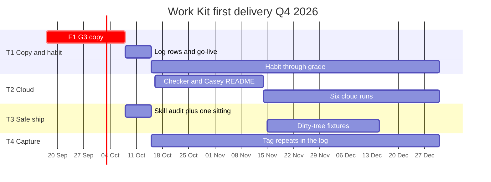

# Product roadmap: Work Kit first delivery

**Product / area:** Work Kit (`work-kit`). First delivery, not catalog growth.
**Time horizon:** 16 Sep 2026 through 31 Dec 2026 (this quarter). Not a 12-month platform bet.
**Strategic goals:** SMART A (15 Oct go-live), B (80% plan-or-tiny, 8 named-file ships), C (cloud checker + 6 runs). OKRs O1-O4. O4 is not a 15 Oct theme.
**Constraints:** One owner. $0 paid. G3 copy fails today. Cursor chrome not owned. Cloud VMs do not mount local plugins. MIT. No Mixpanel, NPS, or marketplace listing.
**Related:** [SMART goals](q4-2026-smart-goals.md), [OKRs](q4-2026-work-kit.md), [Priority](q4-2026-feature-priority.md), [Scope](../launches/q4-2026-first-delivery-scope.md), [Comms](../launches/q4-2026-first-delivery-comms.md)
**Source prompt:** [Product roadmap](https://aiuxplayground.com/prompts/product-roadmap-creation) (AI UX Playground)

**Version.** 2026-09-16. Proposed. Invalid if F1 is still open on 8 Oct and 15 Oct is not slipped.

Playground "Q1 / Q2 / Q3+" maps to three gates, not calendar 2027 quarters:

| Prompt bucket | Work Kit window | Gate |
| --- | --- | --- |
| Next ~3 weeks (now to 15 Oct) | Phase 1 | G1-G4 |
| Months 4-6 analog (16 Oct to 14 Nov, then runs) | Phase 2 | O2 checker |
| Months 7+ analog (15 Nov to 31 Dec) | Close Q4 | Grade. 2027 only if O4 KR3 is yes |

---

## 1. Roadmap overview

**Themes.** T1 Copy and habit (Avery desktop). T2 Cloud loop (Casey). T3 Safe ship. T4 Capture repeats. Cut: marketplace, first-run UI, comparison SEO, catalog dumps as launch.

**Objectives.** Avery's next product-repo sitting is `/plan` or tiny, then named-file `/ship`, logged. Casey's VM loads core skills. No secrets in `/ship`.

**Success metrics.** G3 binary. Log rows. Plan-or-tiny rate. Named-file ship count. Checker exit code. Six cloud loads. Zero `.env` from `/ship`. Not star counts.

If G3 slips, the whole gantt slides. Do not keep a yellow 15 Oct bar.

---

## 2. Themes and initiatives

### T1. Copy and habit

Desktop install teaches `/plan`, then Avery actually logs plan-or-tiny ships.

**Rationale.** Problem statement: install succeeds, loop never runs. Live copy still trains skip (competitive UX vs default chat).

**Initiatives.** F1 G3 copy (US-1). F2 log (US-6). F3 timed E1 (US-2). F4 tiny skip (US-4). F13 same-day reinstall. US-3 plan accept. Interviews leftover only.

**Outcome.** 15 Oct go-live row. 31 Dec 80% and 8 ships.

### T2. Cloud loop

Casey path is required for cloud work, not Avery step 3.

**Rationale.** VMs do not mount `~/.cursor/plugins/local`.

**Initiatives.** F7 checker. F8 Casey README. F9 second environment. F10 six runs.

**Outcome.** Checker fail-closed by 14 Nov. Six loads by 31 Dec. Avery's three beats unchanged.

### T3. Safe ship

Named files, hooks on, no secrets.

**Rationale.** `git add .` on a dirty tree is a last-mile fail.

**Initiatives.** US-5 skill + one sitting + `git show --stat`. F6 verdict. F11 fixtures by 15 Dec. F14 hook drill.

**Outcome.** Zero `.env` from `/ship`. G4 adjacent.

### T4. Capture

Repeated sittings become `SKILL.md`. After the loop is logged.

**Rationale.** O4. Chat memory dies. Do not capture Playground installs.

**Initiatives.** F12 four captures from log repeats. O4 KR3 disappointment on 31 Dec.

**Outcome.** Four new skills from Q4 repeats, reinstalled. Not a 15 Oct theme.

---

## 3. Timeline structure

### Now to 15 Oct (phase 1)

**Initiatives.** F1, F2, F4, F6, F13, F3, F5/US-5 sitting. US-1 AC then the actual echo edit.

**Major features.** Three-beat install. One logged named-file ship. Customize visible.

**Dependencies.** F1 before usability/survey. F1 before T2 copy so sync is not Avery step 3. Empty log blocks the go-live row.

**If this window misses.** Slip 15 Oct. Do not start T2.

### 16 Oct to 14 Nov (phase 2 start)

**Initiatives.** F8 + F7 together. F9. Start F10 after checker green. Keep logging (T1 habit).

**Major features.** Fail-closed sync. Casey pass/fail README.

**Dependencies.** Phase 1 G3 green. Cursor Sync Skills toggle still exists.

### 15 Nov to 31 Dec (close Q4)

**Initiatives.** Finish F10. F11, F14, F12, F15 Riley paragraph. F16 only if plan-or-tiny is still under 80% with good copy.

**Major features.** Fixtures. Four captures. Grade.

**Dependencies.** Log repeats for F12. Checker green for counting cloud runs.

**2027 (not committed).** Only if O4 KR3 is "very disappointed." Possible: F16, stronger Casey, Riley as a path. Not default: public GA, marketplace, NPS.

---

## 4. Feature prioritization

**High (must, in order).** F1, F2, F4/F6/F13, F3, US-5 sitting, then F8/F7, F10.

**Medium (grade, not 15 Oct).** F11, F12, F9, F14, F15.

**Nice-to-have / leftover.** F17 interviews, F18 survey after G3, F16 evidence-gated.

**Cut.** Marketplace, dashboard, Mixpanel, Product Hunt, catalog dump, first-run UI, comparison SEO.

**Rationale.** Gate then value/effort. Reach is one operator. See [priority](q4-2026-feature-priority.md).

---

## 5. Dependencies and sequencing

**Feature.** US-1 before F18. US-1 list split before F8. F7 green before F10. F2 before F12. US-3/US-4 before a meaningful US-5 sitting. F16 after weeks of log, not before G3.

**Technical.** Cursor loads real dirs under `~/.cursor/plugins/local/`. Cloud reads `~/.cursor/skills/`. Git hooks on. GitHub clone.

**Resource.** All hours are Sarah. A Playground template session consumes the F1 session. Sequence: copy, log, clock, ship-safety, checker, cloud runs, fixtures, capture.

---

## 6. Resource planning

**Team.** 1. Product, eng, design (copy), QA: Sarah.

**Skills.** Markdown, bash, git, Cursor plugin paths, honest logging.

**External.** Cursor product behavior. GitHub. Optional: 5 to 8 ICs unpaid, or $400 gift cards if approved.

**Budget.** $0 GTM. No vendors. No Mixpanel contract.

---

## 7. Risk assessment

| Risk | Theme | Mitigation | Contingency |
| --- | --- | --- | --- |
| G3 still mismatch on 8 Oct | T1 | Treat date as hard | Slip 15 Oct. Last good install SHA |
| Docs instead of echo | T1 | Scope: refuse templates before F1 | This roadmap is invalid until F1 |
| Log abandoned | T1 T4 | Missing week = 0 | Fail SMART B, do not impute |
| Sync put back as Avery step 3 | T1 T2 | Split lists | Re-fail G3 |
| Checker false green | T2 | Fail closed, miss-case | Manual `ls` until fixed |
| `.env` in a `/ship` | T3 | P0, stop go-live | Revert. Expand F5/F11 |
| Cursor changes plugin paths | All | Re-read install-work-kit in Nov | Slip T2, keep T1 copy |
| F16 breaks tiny skip | T1 | Wait for log | Leave skill as-is |

**Review.** Weekly 15 min. 8 Oct SLC. 15 Oct go/no-go. 22 Oct rate. Month-end forecast. 14 Nov checker. 31 Dec grade.

---

## 8. Success metrics

| Theme | Metric | When |
| --- | --- | --- |
| T1 | G3 pass. Log rows. Plan-or-tiny. E1 minutes | 8 Oct, weekly, 31 Dec |
| T2 | Checker exit. 6 loads | 14 Nov, 31 Dec |
| T3 | `named_files=yes`. Zero `.env` from `/ship`. Fixtures 10/10 | Go-live, monthly, 15 Dec |
| T4 | 4 captures from repeats. Disappointment yes/somewhat/no | 31 Dec |

**Progress.** Session log plus git. Not a roadmap tool.

**Adjust.** If G3 fails SLC, slide phase 1 only. Do not steal T1 hours for T4. Re-score [priority](q4-2026-feature-priority.md) after F1 and after week 1 of rows.

---

## 9. Communication plan

**Stakeholders.** Sarah. Optional clone visitor.

**Team.** There is no team standup. Weekly log is the update.

**Customer.** README and script echo. No press, no Product Hunt, no email drip. Teammate paste from [comms](../launches/q4-2026-first-delivery-comms.md) only if someone clones.

**Frequency.** Echo/README when copy changes (same commit). Log weekly. Do not announce 15 Oct if G3 is yellow.

---

## 10. Roadmap maintenance

**How to update.** Edit this file in git. Bump the version date. Do not keep a second roadmap in a slide.

**When to reassess.** F1 lands. Week 1 of rows. Cursor path change. Two of five survey Q21 = no. `.env` P0. 8 Oct miss. 31 Dec grade.

**Change process.** [Scope](../launches/q4-2026-first-delivery-scope.md) section 8. One paragraph, gate, Sarah yes/no. Default refuse: marketplace, NPS, templates before F1.

**Version control.** This repo. Filename stays. History is git log, not a Confluence row.

---

## Now

Next bar on the gantt is F1: `install-local.sh` and README step 3 = `/plan`. Everything to the right is fiction until that bar is green.
