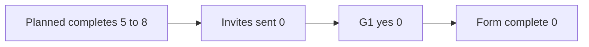

# Survey analysis: Work Kit first-delivery beta form

**Survey purpose.** After G3, learn whether install copy leads to `/plan` without a researcher, what people skip, what blocks named-file `/ship`, and whether Cloud Agents still look empty.
**Instrument:** [Beta feedback survey](first-delivery-beta-survey.md)
**Target audience:** 5 to 8 Avery-like Cursor ICs who installed after G3. Owner diary is not a survey row.
**Field window:** 8 to 14 Oct 2026, only if G3 copy matches. Close 14 Oct. No collection on 15 Oct.
**Respondents (this extract):** 0 completes. 0 partials. 0 G1=yes. 0 G1=no. 0 invites sent.
**Extract date:** 16 September 2026
**Related:** [Insights](first-delivery-insights.md), [Recruitment](first-delivery-recruitment.md), [Feature priority](../okrs/q4-2026-feature-priority.md), [Feedback triage](first-delivery-feedback-triage.md)
**Source prompt:** [Survey analysis framework](https://aiuxplayground.com/prompts/survey-analysis-framework) (AI UX Playground)

The Playground prompt asked to paste responses. There are none. This report does not invent distributions, correlations, quotes, or NPS. Product inspection (script echo, empty session log) lives in the insights file. It is not survey data. Rewrite sections 1 to 7 from a real export on 14 Oct. Until then, treat every chart below as a zero-count.

---

## 0. Why the table is empty

The form must not be sent against the current `install-local.sh` echo (step 3 is still optional cloud sync). Fielding checklist item 1 fails. Inviting testers now would measure the old copy and call it first-delivery UX.



| Stage | Planned | Actual 16 Sep |
| --- | --- | --- |
| Recruited and installed after G3 | 5 to 8 | 0 |
| Invites | 5 to 8 | 0 |
| G1 = yes (ran install this week) | 5 to 8 | 0 |
| Completes | 5 to 8 | 0 |
| Backups unused | 2 to 3 | 0 |

---

## 1. Quantitative analysis

**Key metrics.** All counts are 0. Do not report percentages of 0. Do not average blank 1-5 scales into CSAT. Do not compute NPS. Q7 is not an NPS item.

| Metric | Rule when n is 5 to 8 | Value now |
| --- | --- | --- |
| Completes | Count G1=yes who reached Q21 | 0 |
| Q6 median | 1-5. Disagree means G3 still failing | n/a |
| Q8 count of 4 or 5 | Next sitting starts with `/plan` or tiny | 0 |
| Q10 copy-led `/plan` | G3 win | 0 |
| Q10 skip to implement | Hypothesis cell | 0 |
| Q15 yes | Hit a delivery-blocking or slowing issue | 0 |
| Q21 no | If 2 or more of 5, slip 15 Oct | 0 |
| Q21 yes with changes | List Q22 themes | 0 |

**Response distributions.** Empty. When data exists, show counts for Q2 (commands), Q10 (start), Q21 (launch call), Q5 (seat). Stack, do not percent.

**Significant correlations.** Do not run them on n=5 to 8. A p-value here is theater. When data exists, only cross-tab: Q10 start vs Q6, and Q3 cloud vs Q12 skills loaded. Report the 2x2 counts. Stop.

**Demographic breakdowns.** The screener does not collect age, gender, or ethnicity. Break down by seat (Q5) and cloud (Q3) only. Current: 0 personal, 0 Teams, 0 Enterprise, 0 cloud-yes.

```
Q21 launch call (counts)
yes                0
yes with changes   0
no                 0

Q10 first session start (counts)
copy said /plan    0
already /plan      0
implement, no plan 0
/debug first       0
tiny skip          0
other              0
```

---

## 2. Qualitative analysis

**Themes from open-ended responses.** None. Q14, Q16, Q22, Q23, Q24 to Q27 have no text.

**Common phrases.** None from respondents. Copy we will search for later, because they mark G3: "plugin visible", "Customize", "optional", "sync", `/plan`, "just implement", `git add .`, `.env`.

**Sentiment.** Not scored. No lexicon pass on an empty sheet. Do not paste a 70% positive number.

**Notable quotes.** None. Do not write example quotes. When text exists, quote only if Q27b is yes or interview consent already covers it. Redact repo names, employer names, secrets.

---

## 3. Key findings

Top findings from this extract, in impact order:

1. **n=0.** There is no beta survey dataset. Design cannot be ranked from this form yet.
2. **Fielding is blocked on G3.** The instrument itself forbids sending until script and README step 3 are `/plan`.
3. **Owner diary is not a substitute row.** Mixing Sarah into n would fake a complete.
4. **Planned sample is 5 to 8, not 100.** Even after fielding, report counts. No significance theater.
5. **Launch items are Q6, Q8, Q10, Q21.** Those four are the only survey inputs to 15 Oct go/no-go, and only after G3.
6. **Q7 will not become NPS.** Cut as a KPI in OKRs and the metrics spec.
7. **Empty session log is still empty.** That is operations, not this survey. See insights.

**Surprising discoveries.** None from survey. A surprise that is not survey: planning docs already name G3 while the echo is unchanged. That belongs in [insights](first-delivery-insights.md), insight 3.

**Confirmed assumptions.** One process assumption holds: we did not mail a ghost cohort against the old copy.

**Disproven assumptions.** None. The skipper hypothesis, copy-led `/plan`, and "ready to tell another IC" are untested in this form.

---

## 4. User segments

No segments from responses. Planned cells from recruitment, all empty:

| Segment | Planned completes | Actual | Need we will look for | Design implication if the cell fills |
| --- | --- | --- | --- | --- |
| Avery-like desktop IC | 5 | 0 | `/plan` from copy, not from a researcher | If Q10 is skip, F1 copy is still wrong |
| Casey-like (also Cloud Agents) | 2 of 5, or +2 later | 0 | Q12 skills loaded | If no, F7/F8, not Avery step 3 |
| Riley-like Teams/Enterprise | at most 1 | 0 | Customize visible | Recovery paragraph F15, not a happy-path rewrite |
| Owner | 0 in this n | 0 | Session log | Log rows. Not this form |

Needs and preferences by segment cannot be stated from blanks.

---

## 5. Pain points and frustrations

**From this survey.** 0 mentions. Severity n/a. Frequency 0.

**Do not import these as survey pains** (they are product inspection, already written):

| Pain | Source | Survey item that would catch it later | Severity if it shows up |
| --- | --- | --- | --- |
| Step 3 is optional cloud sync | `install-local.sh` line 30 | F2 fix lines, Q6, Q10 | Blocking for G3 |
| README catalog as step 3/4 | README checkout list | F2, Q26 | Blocking for G3 |
| No session rows | `session-log.md` | not in this form | Blocking for O1 KR2 |
| Secrets or `git add .` | not observed in git this extract | Q15-Q17, F3 | P0 if a tester hits it |

Context for future open text: first sitting after install, throwaway vs real repo (Q1), seat (Q5).

---

## 6. Opportunities

**From survey data.** None until completes exist.

**From the empty state itself (process).**

- **Quick win.** Do not send the form. Edit F1 copy. Then invite.
- **Quick win after first complete.** Read Q10 and Q21 that day. Do not wait for n=8 to slip 15 Oct if two people say no.
- **Long-term.** After 14 Oct export, theme Q22/Q26 into README sentences. Capture only workflows that repeat in the session log (O4), not survey feature wishes.
- **Impact.** Survey can confirm or kill G3 after copy changes. It cannot replace the copy change.

---

## 7. Design recommendations

Prioritized by impact and feasibility. Survey weight is zero until n>0. Rank 1 is still F1 from product evidence.

| Rank | Recommendation | Why | Feasibility | Success metric | Survey weight today |
| --- | --- | --- | --- | --- | --- |
| 1 | Change script and README step 3 to `/plan` or `/debug` if broken. Move sync off Avery's list. | Inspection. Form forbids fielding until this lands. | Under 2 hours | G3 pass. Later: Q10 copy-led `/plan` count | 0 |
| 2 | Log the next product-repo sitting | Empty denominator | Under 2 hours | One filled row | 0 |
| 3 | Field this form after G3, cap 5 to 8 | Instrument is ready | Hours of DMs, not engineering | Completes 5 to 8 by 14 Oct | n/a |
| 4 | If 2+ of 5 on Q21 = no, slip 15 Oct | Pre-registered in the survey spec | Decision, not a build | Go/no-go uses G1-G4 plus this rule | 0 |
| 5 | Do not build a dashboard, NPS, or first-run UI from this empty extract | SLC. No data. | Easy because it is a cut | Not built | 0 |

**Next steps.**

1. F1 copy. Stop.
2. One log row.
3. Usability, then this form.
4. Replace this file's zeros with counts on 14 Oct. Put anonymized quotes only with Q27b.
5. 22 Oct synthesis uses survey counts plus interviews plus the log. Still no Mixpanel.

---

## Codebook (use on 14 Oct)

Replace section 1 tables with counts. Keep this file's structure.

- Completes = G1 yes and Q21 answered.
- Drop G1 no from all later tables.
- Q6, Q8: report median and the 1-5 count row. No mean.
- Q10: six-way count. Copy-led is the G3 win. "Already `/plan`" is not a README win.
- F2 open "fix": one theme per sentence. Map to README or script line.
- Q15 yes + blocking + secrets or extra files = P0, do not wait for more n.
- Q21 no >= 2 among first 5 completes = recommend slip.
- Cross-tabs only: Q10 x Q6, Q3 x Q12.
- Segments: Avery default. Casey if Q3 yes. Riley if Q5 is Teams or Enterprise, cap 1 in the write-up unless a Riley study was opened.

If n is still 0 on 14 Oct, keep this extract. Do not fill it with owner answers.
