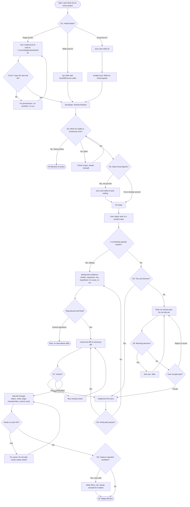

# User Flow: Install Work Kit and Complete First Delivery

**Product:** Work Kit (`work-kit`) — personal Cursor plugin for every project
**Feature:** Install once at user scope, then run the Plan → Debug → Review → Ship loop
**Job to be done:** “When I start work in Cursor, I want a consistent plan-first, evidence-based, review-then-ship path so the change lands cleanly without copying kit files into every repo.”
**Source prompt:** [User Flow Mapping](https://aiuxplayground.com/prompts/user-flow-mapping) (AI UX Playground)

---

## 1. Flow Overview

### Primary user goal

Install Work Kit so it applies to **every** Cursor project, then complete one real change using the kit’s delivery loop:

1. **Plan** the work (`/plan` → `plan-the-work`)
2. **Implement** the first slice (or **debug from evidence** if something is already broken)
3. **Review** the actual diff (`/review-diff` → `review-the-diff`)
4. **Ship** a precise commit and push (`/ship` → `ship-the-change`)
5. Optionally **capture** a repeated workflow as a skill (`/new-skill` → `capture-a-skill`)

Success is not “plugin files exist on disk.” Success is: the agent follows the kit, the user can accept or reject a plan, and a verified change leaves the machine on a branch.

### Entry points

| ID | Entry | When it is used |
| --- | --- | --- |
| E1 | Clone GitHub + `./scripts/install-local.sh` | First desktop install from [Ses2905/cursor-skills](https://github.com/Ses2905/cursor-skills) |
| E2 | Already have a checkout → `./scripts/install-local.sh` | Reinstall after editing this repo |
| E3 | `npx skills add https://github.com/Ses2905/cursor-skills` | Skills-only install (no plugin copy to `~/.cursor/plugins/local`) |
| E4 | Invoke `/install-work-kit` in chat | User asks how to install, set up globally, or reuse skills on Cloud Agents |
| E5 | Slash commands `/plan`, `/debug`, `/review-diff`, `/ship`, `/new-skill` | User already has the plugin and starts a task |
| E6 | Agent-decides skills (`plan-the-work`, `debug-from-evidence`, …) | Agent matches the request without an explicit slash |
| E7 | Cloud path: `./scripts/sync-user-skills.sh` + Sync Skills for Cloud Agents | Desktop plugin is invisible on cloud VMs |

Non-entries (explicitly out of this flow): installing marketplace plugins into a **project** (they belong at **user** scope), dumping an entire GitHub skills catalog, or copying this plugin into each application repo.

### Success criteria

The flow is successful when **all** of the following are true:

- `~/.cursor/plugins/local/work-kit` exists as a **real directory** (not a symlink to this checkout), **or** the user knowingly chose the skills-only path (E3).
- After **Developer: Reload Window**, **Customize → User** shows **Work Kit**.
- Core skills are invokable: `/plan-the-work`, `/debug-from-evidence`, `/review-the-diff`, `/ship-the-change`.
- For a non-trivial request, the agent writes a plan the user can accept or reject **before** editing (unless the change is already tiny and obvious).
- Shipping uses the actual diff: intended files only, no secrets, verification ran, commit message is imperative and specific.
- If the user needs Cloud Agents: skills live in `~/.cursor/skills/` and **Settings → Agents → Context and Tools → Sync Skills for Cloud Agents** is on.

### Key personas

| Persona | JTBD | Constraints |
| --- | --- | --- |
| **Avery — solo IC** | Same quality bar in every personal repo without boilerplate | Owns the machine; can clone, run scripts, reload Cursor |
| **Riley — team engineer** | Use the kit on a company Cursor Teams/Enterprise seat | Local plugin imports may be blocked until an admin allows them |
| **Casey — cloud-first** | Kick off Cloud Agents that still follow plan/debug/review/ship | `~/.cursor/plugins/local` is **not** on cloud VMs; only `~/.cursor/skills/` syncs |

---

## 2. Step-by-Step Flow

Happy path below is **Avery, E1**, then a non-trivial feature request. Branches for Riley, Casey, E3, debug-first, and tiny-change skip are in §2.9 and §4.

### 2.1 Discover and choose an install path

| | |
| --- | --- |
| **User actions** | Opens the GitHub README or asks Cursor “how do I install work-kit?” (E4). Chooses clone+script, existing checkout, or `npx skills add`. |
| **System responses** | README / `install-work-kit` skill lists the three desktop paths and the Cloud Agents caveat. Scripts are not run yet. |
| **Decision** | **D1 — Install shape?** → Plugin (E1/E2) vs skills-only (E3) vs Cloud-first (E7). |

### 2.2 Install the plugin on the machine

| | |
| --- | --- |
| **User actions** | `git clone https://github.com/Ses2905/cursor-skills.git`, `cd cursor-skills`, `chmod +x scripts/*.sh` if needed, `./scripts/install-local.sh`. Optionally `./scripts/sync-user-skills.sh`. |
| **System responses** | `install-local.sh` copies the repo (minus `.git`, `agent-tools`, `.DS_Store`) to `~/.cursor/plugins/local/work-kit` as a real folder. Prints next steps: reload, confirm Customize, optional cloud sync. |
| **Error / recovery** | Script fails (`set -e`): missing `skills/`, no write access to `~/.cursor/plugins/local`, `rsync`/`tar` error. User fixes permissions or Cursor config home and re-runs. Do not “fix” by symlinking the checkout into `local/` — Cursor ignores those symlinks. |

### 2.3 Activate in Cursor

| | |
| --- | --- |
| **User actions** | Command Palette → **Developer: Reload Window**. Opens **Customize**, filter **User**, looks for **Work Kit**. |
| **System responses** | Plugin metadata from `.cursor-plugin/plugin.json` (`displayName: Work Kit`) appears at user scope. Skills show under **Agent Decides**. Slash commands `/plan`, `/debug`, `/review-diff`, `/ship`, `/new-skill` become available. |
| **Decision** | **D2 — Work Kit visible?** Yes → continue. No → §4.2 (Teams block, wrong scope, forgot reload). |

### 2.4 Optional: enable Cloud Agent skill sync

| | |
| --- | --- |
| **User actions** | If they use Cloud Agents: run `./scripts/sync-user-skills.sh`, then enable **Settings → Agents → Context and Tools → Sync Skills for Cloud Agents**. |
| **System responses** | Each `skills/*/SKILL.md` folder is copied to `~/.cursor/skills/<name>`. UI copy reminds: only `~/.cursor/skills/` syncs; local plugins do not. |
| **Decision** | **D3 — Need Cloud Agents?** No → skip. Yes and sync off → Casey’s later cloud run has no kit skills. |

### 2.5 Start a unit of work (plan)

| | |
| --- | --- |
| **User actions** | In a **product repo** (not necessarily this kit repo), describes a change or types `/plan`. |
| **System responses** | `/plan` loads `skills/plan-the-work/SKILL.md`. Agent does **not** edit yet. Writes: Goal, Out of scope, Approach (3–7 steps), Risks, First slice, Verify. Prefers existing stack. |
| **Decision** | **D4 — Is the request tiny and obvious?** Yes → skip long plan, say implementing directly. No → wait for accept/reject. **D5 — Blocking decision?** (API shape, new service, destructive migration) → stop and ask. Else pick a default and note it. |
| **Error / recovery** | User rejects the plan → revise Goal / Out of scope / First slice; still no code. User stays silent → do not start editing. |

### 2.6 Implement the first slice (or debug instead)

**Happy implement path**

| | |
| --- | --- |
| **User actions** | Accepts the plan (explicit “go”, “do it”, or equivalent). |
| **System responses** | Agent implements only the first slice. `verify-before-done` and `tight-diffs` rules apply: prove it works; change only what the task needs. |
| **Decision** | **D6 — Did the slice verify?** Command, UI path, or test from the plan. Fail → do not claim done; either debug (2.6b) or shrink slice. |

**Debug branch (2.6b)** — user reports a bug, test failure, or “why doesn’t this work?” / types `/debug`.

| | |
| --- | --- |
| **User actions** | `/debug` or describes a failure. |
| **System responses** | Loads `debug-from-evidence`: restate expected vs actual, reproduce, locate first wrong frame, one hypothesis, fix the cause, re-run original reproduction plus one nearby path, report evidence. |
| **Error / recovery** | Cannot reproduce → stop; do not guess-and-patch. Failed experiment → revert; do not stack patches. |

### 2.7 Review the real diff

| | |
| --- | --- |
| **User actions** | `/review-diff` after a sizable change, or before merge. |
| **System responses** | Reviews `git diff` / staged / merge-base, not intention. Groups **Blocker / Should fix / Note**. Checks: extra scope, empty/error/loading paths, verification, secrets/authz. Ends with **ship**, **fix blockers**, or **needs verification**. |
| **Decision** | **D7 — Verdict?** Ship → 2.8. Fix blockers → back to 2.6. Needs verification → user or agent runs the missing check, then re-review. |

### 2.8 Ship the change

| | |
| --- | --- |
| **User actions** | `/ship` or “commit and push”. |
| **System responses** | `git status` + `git diff`. Lightest verification that covers the change. Stage **only** intended files (never `git add .` if junk is present). Imperative ~50–72 character subject. Push with `-u` if no upstream. **Does not open a PR unless asked.** |
| **Error / recovery** | Hook or push failure → fix the cause. Do not `--no-verify` unless the user explicitly wants that. Secrets / `.env` in the diff → unstage and stop. |

### 2.9 Optional: capture a repeated workflow

| | |
| --- | --- |
| **User actions** | `/new-skill` or “this should be a skill.” |
| **System responses** | `capture-a-skill` asks which workflow if unclear. Writes `skills/<name>/SKILL.md` (or a rule/command). If editing work-kit, tells the user to re-run `install-local.sh` and reload. |
| **Decision** | **D8 — Cross-project or repo-only?** Cross-project → this plugin’s `skills/`. Repo-only → that repo’s `AGENTS.md` / `.cursor/skills`. |

### 2.10 End states

| End | Meaning |
| --- | --- |
| **S1 Happy delivery** | Plan accepted, slice verified, review = ship, commit pushed. |
| **S2 Tiny-change skip** | Plan skipped by rule; still verified and shipped. |
| **S3 Debug resolved** | Failure reproduced, cause fixed, reproduction green. |
| **S4 Blocked on policy** | Teams/Enterprise forbids local plugin imports (Riley). |
| **S5 Cloud without skills** | Casey skipped E7; Cloud Agent cannot see the kit. Recover via sync + setting. |
| **S6 Skills-only** | E3 succeeded; plugin Customize card may be absent; slash/skills from `~/.cursor/skills` still work if that CLI target is configured. |

---

## 3. Interaction Details

Work Kit is not a multi-screen product UI. Surfaces are **Cursor chrome + terminal + chat**. Treat those as the UI.

### 3.1 Surfaces and elements

| Step | Surface | Elements |
| --- | --- | --- |
| Install | Terminal | Clone URL, `scripts/install-local.sh`, `scripts/sync-user-skills.sh`, printed “Next:” lines |
| Activate | Command Palette | `Developer: Reload Window` |
| Activate | Customize | Scope filter **User** vs **Project**; plugin card **Work Kit**; skills list **Agent Decides** |
| Cloud | Settings | **Agents → Context and Tools → Sync Skills for Cloud Agents** |
| Policy | Admin dashboard | **Marketplace and Plugins → Allow Local Plugin Imports** |
| Delivery | Chat | Slash commands `/plan`, `/debug`, `/review-diff`, `/ship`, `/new-skill`; skill names `/plan-the-work`, etc. |
| Delivery | Git | Working tree, staged files, branch, upstream, hooks |
| Optional catalogs | Terminal + Customize | `install-catalog-skills.sh --preset design-product`; marketplace plugins from `STARTER_PLUGINS.md` at **user** scope |

### 3.2 Required inputs

| Step | Required from user | Required from environment |
| --- | --- | --- |
| Install | Network access to GitHub; permission to write `~/.cursor/plugins/local` | `bash`, `git`, `rsync` or `tar` |
| Teams install | Admin has allowed local plugin imports | Cursor Teams/Enterprise policy |
| Plan | A request (feature, bug, or “plan this”) | Open workspace (product repo) |
| Plan accept | Explicit accept / reject / revise | — |
| Debug | Failure description or failing command | Reproducible path (test, CLI, or UI) |
| Review | — (diff is the input) | `git` history / uncommitted changes |
| Ship | Intent to commit/push; PR only if asked | Clean intended diff; verification command |
| Capture | Workflow to save; name if not obvious | Write access to kit repo or `~/.cursor/skills` |

### 3.3 Validation points

| ID | Check | Pass | Fail behavior |
| --- | --- | --- | --- |
| V1 | `install-local.sh` exit 0 and dest exists | Echoes install path | Script aborts (`set -euo pipefail`) |
| V2 | Dest is a real directory, not a symlink into the checkout | Plugin can load | Cursor ignores the plugin; Customize empty |
| V3 | Customize → User → Work Kit | Card present | See D2 / §4.2 |
| V4 | Plan has all six sections | User can accept/reject | Agent must not start editing |
| V5 | First slice has a verify method | Command, UI path, or test named | Plan is incomplete |
| V6 | Debug: reproduction output saved | Expected vs actual captured | No code changes |
| V7 | Review skimmed every changed file | Findings + verdict | Incomplete review |
| V8 | Ship: diff matches request; no secrets; no unrelated `git add .` | Commit created | Unstage / stop |
| V9 | Cloud: skills in `~/.cursor/skills/` and sync toggle on | Cloud Agent can load SKILL.md | Kit skills missing in cloud |

### 3.4 Feedback mechanisms

| Event | Feedback |
| --- | --- |
| Install success | Terminal: `Installed work-kit to ~/.cursor/plugins/local/work-kit` + numbered next steps |
| Sync success | Terminal: `Copied N skill(s) to ~/.cursor/skills` + reminder that plugins do not sync |
| Plan ready | Chat: six-section plan; explicit wait |
| Tiny skip | Chat: “implementing directly” + why |
| Debug | Chat: restated failure, evidence, one hypothesis, then root cause + fix + re-run result |
| Review | Chat: severity table + **ship / fix blockers / needs verification** |
| Ship | Git commit hash, branch, upstream; PR URL only if requested |
| Capture | Path to new `SKILL.md`; reminder to reload (and re-run install-local if kit was edited) |
| Errors | Script stderr; Cursor missing-plugin empty state; hook output on failed push |

---

## 4. Edge Cases

### 4.1 Alternative paths

| Path | How it diverges |
| --- | --- |
| **E2 reinstall** | Skip clone. After editing this repo, re-run `install-local.sh` or the copy in `~/.cursor/plugins/local` is stale. |
| **E3 skills-only** | No plugin directory. Marketplace-style plugin card may never appear. User still gets SKILL.md files via the skills CLI. Slash commands from this plugin’s `commands/` may be missing unless also installed as a plugin. |
| **Debug-first** | Skip plan if the job is “this is broken.” Enter at 2.6b. After the fix, still review and ship. |
| **Tiny change** | Plan skill allows skipping the long plan. Still verify and still avoid `git add .`. |
| **Capture without shipping** | User saves a workflow mid-loop. Does not replace review/ship for code changes. |
| **Catalog / design extras** | `./scripts/install-catalog-skills.sh --preset design-product` or `/install-github-skills` — parallel onboarding, not required for first delivery. |
| **Marketplace starters** | Continual Learning, Create Plugin, GitHub at **user** scope (`STARTER_PLUGINS.md`). Orthogonal to the delivery loop. |
| **Repo-specific knowledge** | Facts stay in the **product** repo (`AGENTS.md`, `.cursor/rules`, `.cursor/skills`), not in work-kit. |

### 4.2 Error scenarios

| Scenario | User sees | Recovery |
| --- | --- | --- |
| Teams/Enterprise blocks local plugins | Work Kit missing after a “successful” script | Admin enables **Allow Local Plugin Imports**, or fall back to E3 / `~/.cursor/skills` |
| Forgot Reload Window | Skills and slash commands absent | Run **Developer: Reload Window**, re-check Customize → User |
| Installed at project scope | Kit only in one repo | Remove project install; install at user scope per README |
| Symlink instead of copy | Plugin ignored | Delete dest; re-run `install-local.sh` (it `rm -rf`s dest and copies) |
| Cloud Agent missing skills | Agent does not follow plan/debug/review/ship | `sync-user-skills.sh` + enable Sync Skills for Cloud Agents |
| Plan rejected, agent coded anyway | Unwanted diff | User stops; revert; re-run `/plan`. This is a kit **violation**, not a valid branch. |
| Cannot reproduce a bug | Agent proposes speculative edits | Forbidden. Gather more evidence or stop. |
| Review finds blockers | Verdict: fix blockers | Return to implement/debug; do not `/ship` |
| Ship would commit `.env` / secrets | Diff includes secrets | Unstage, add to gitignore if needed, never commit |
| Pre-commit / push hook fails | Push rejected | Fix the cause; no `--no-verify` unless explicitly requested |
| Unrelated dirty files | `git add .` would scoop junk | Stage named paths only |
| `npx skills add` vs plugin mismatch | Skills present, `/plan` slash missing | Install plugin path (E1/E2) if commands are required |

### 4.3 Empty states

| Empty state | Copy / behavior |
| --- | --- |
| Customize → User, no Work Kit | “Install from this checkout with `./scripts/install-local.sh`, then reload. On Teams, local imports must be allowed.” |
| Chat, no matching skill | Agent should still not invent a parallel process; point at `/install-work-kit` or README. |
| `/review-diff` with no changes | Report clean tree; nothing to review. |
| `/ship` with empty diff | Do not create an empty commit. |
| `/new-skill` with no workflow named | Ask which workflow to capture. |
| `/debug` with no failure | Ask for expected vs actual and a reproduction path. |
| Catalog script with no preset | User must pass `--preset` (see `install-github-skills`); do not dump the whole catalog. |

### 4.4 Offline / environment handling

| Condition | Handling |
| --- | --- |
| **Offline clone** | `git clone` and `npx skills add` fail. Need network once. A prior checkout can still run `install-local.sh` offline. |
| **Offline Cloud Agent sync** | Sync copies local files; the **Cursor setting** still must be enabled when online enough for Cloud Agents to pick up the library. |
| **No `rsync`** | Script falls back to `tar`. |
| **No git in product repo** | Review and ship cannot run. Plan/implement may still work; ship must stop and say so. |
| **Broken Cursor config home** | `DEST` under `$HOME/.cursor/plugins/local` unwritable → script fails; do not write into the product repo. |
| **Partial copy** | `rm -rf "$DEST"` then full copy. Re-run the script; do not hand-merge. |

---

## 5. Visual Flow Diagram

Notation: stadium = start/end, rectangle = process, diamond = decision, parallelogram = user input.



### Compact swimlane (persona × stage)

```text
                 Discover          Install           Activate            Deliver
Avery (solo)     README / E4   →   clone + script →  Reload + Customize → /plan → slice → /review-diff → /ship
Riley (team)     README        →   script        →  D2 policy gate     → same delivery if allowed
Casey (cloud)    Cloud VM      →   E7 sync       →  Sync Skills toggle → same skills, no local plugin
```

### Journey map (emotions and friction)

| Stage | Touchpoint | User action | Emotion | Pain point | Opportunity |
| --- | --- | --- | --- | --- | --- |
| Awareness | GitHub / chat | Learns “install once, user scope” | Curious | Might copy files into every repo | Lead with “do not copy into each repo” |
| Acquisition | Terminal | Runs `install-local.sh` | Hopeful | Symlink / Teams block / forgot chmod | Script copy + explicit Teams note |
| Onboarding | Customize | Reload, confirm Work Kit | Relieved or stuck | Empty Customize after “success” | Check D2 before first `/plan` |
| First value | Chat `/plan` | Accepts a scoped plan | Confident | Agent codes before accept | Plan skill: wait for accept |
| Engagement | `/debug` `/review-diff` | Evidence, then verdict | Trust if evidence is real | Guess-and-patch, review of “intention” | Force reproduce + actual diff |
| Retention | `/ship` | Clean commit | Done | `git add .`, secrets, surprise PR | Stage named files; PR only if asked |
| Advocacy | `/new-skill` | Saves a workflow | Proud | Skill lives only in one repo | Default to kit `skills/` + reinstall |

**Aha moment:** The first time `/plan` produces a six-section plan and waits — the kit is working, not just installed.

**Moments of truth:** D2 (plugin visible), D6 (verify), D7 (review verdict), V8 (ship does not scoop junk).

**Churn triggers:** Teams block with no fallback; Cloud Agent silently missing skills; agent that ignores the plan gate.

---

## Appendix: Command and skill map

| User types | Skill file | Allowed to edit code? |
| --- | --- | --- |
| `/plan` | `skills/plan-the-work/SKILL.md` | Not until plan accepted (or tiny skip) |
| `/debug` | `skills/debug-from-evidence/SKILL.md` | Only after reproduction + one hypothesis |
| `/review-diff` | `skills/review-the-diff/SKILL.md` | No (review only) |
| `/ship` | `skills/ship-the-change/SKILL.md` | Git only, after verification |
| `/new-skill` | `skills/capture-a-skill/SKILL.md` | Skill/rule/command files |
| `/install-work-kit` | `skills/install-work-kit/SKILL.md` | No; explains install |

Related always-on rules: `verify-before-done`, `tight-diffs`.
